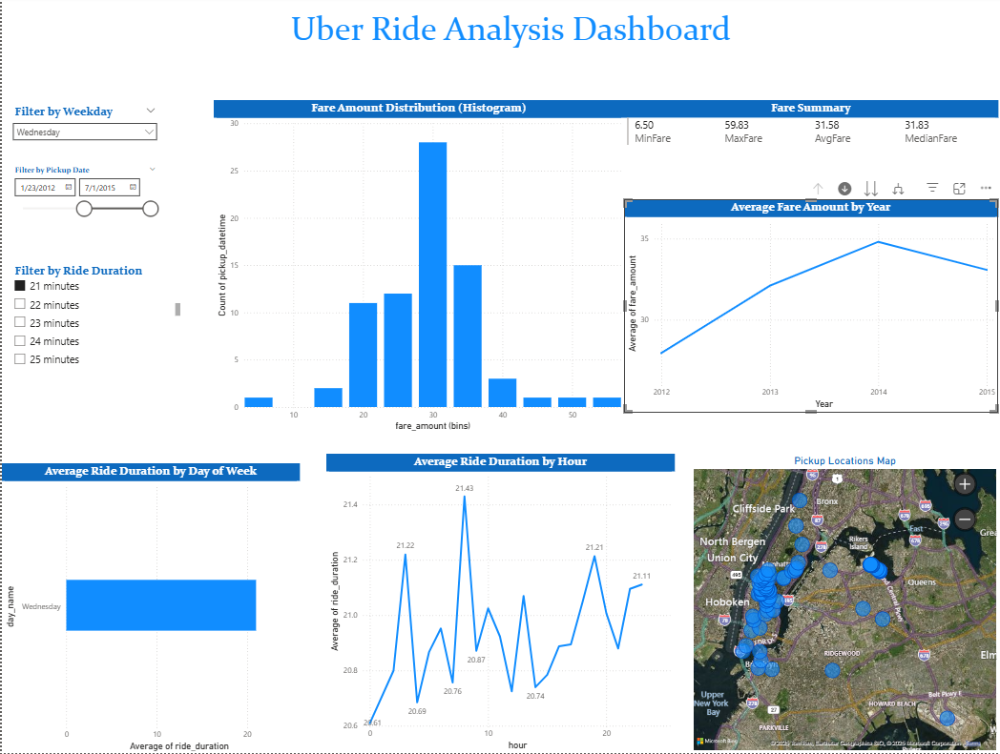

**Student:** Isimbi Mushimire Iris 

**ID**: 27121 

**Course:** Introduction to Big Data Analytics     

## **1. Introduction**
This project focuses on analyzing the Uber Fares Dataset, sourced from Kaggle, to gain comprehensive insights into fare patterns, ride durations, and key operational metrics. Using Python for data cleaning and exploratory analysis, and Power BI Desktop for interactive visualizations, the goal is to understand how fares vary by time, location, and other factors.
This project analyzes Uber trip data to identify:
- Fare patterns across time and locations
- Peak demand periods for strategic planning
- Relationships between distance, time, and pricing  
**Objective**: Provide data-driven insights to optimize Uber's pricing and driver allocation strategies.

---

## **2. Methodologies & Tools**
### **Data collection**
The Uber Fares Dataset was downloaded from Kaggle. The dataset contains detailed information about Uber rides, including fare amounts, timestamps, distances, and locations.
### **Data Preparation**
| Tool | Purpose | Example |
|------|---------|---------|
| Python (Pandas) | Data cleaning & feature engineering | `df['hour'] = df['pickup_datetime'].dt.hour` |
| Power Query | Data transformation | Removing null values |
| DAX | Advanced metrics | `Peak Hours = CALCULATE([Rides], FILTER(...))` |

### **Data Cleaning**
This process focused on removing inconsistencies, standardizing formats, and enhancing temporal and spatial dimensions for further analysis.

### **Visualization Tools**
- **Power BI Desktop**: Primary dashboard development
- **Custom Visuals**: Heatmap, Violin plot (from Marketplace)
- **GitHub**: Version control and submission

**Heapmap**:

**Dashboard Development**:

**GitHub**:

https://github.com/irisisimbi/Uber_fares.git

---

## **3. Analysis & Findings**
After thorough data cleaning and feature engineering, the refined dataset was imported into Power BI Desktop for advanced analysis and visualization. A series of interactive and dynamic dashboards were developed to comprehensively explore multiple facets of Uber ride data. These dashboards enable intuitive user interaction, such as filtering by time intervals, geographic locations, and fare ranges, supporting detailed data-driven insights.

**Key analytical focuses included**:

**Fare Patterns Across Various Time Frames**: Visualization of fare distributions by hour of day, day of week, and month to capture temporal pricing dynamics.
**Ride Volume Analysis**: Identification of peak demand hours and days through time-series line charts and bar graphs, revealing critical periods for operational focus.

**Time analysis**

Using Power BI visualizations (line charts, clustered bar charts):

- **Hourly Patterns:**  
  Peak demand times were identified between **8 AM–9 AM** and **5 PM–6 PM**, aligning with typical commute hours.

- **Daily & Weekly Trends:**  
  Fridays recorded the **highest number of rides**, with an average **40% increase** in ride volume compared to other weekdays.

- **Monthly Ride Patterns:**  
  Rides peaked during summer months, suggesting potential seasonal influences on ride demand.

**Fair distribution**
A histogram and box plot were used to visualize fare distribution:

- Most rides had fare amounts

 

 **Fare Distribution**
  Understanding how fares are distributed provides key insights into ride pricing and customer behavior. This analysis helps Uber assess the typical cost of rides, detect pricing anomalies, and fine-tune fare models.

---
Peak Ride Hours: The most significant ride volumes occur between 6 PM and 7 PM, coinciding with evening rush hours and high commuter demand. Extended high activity persists from 6 PM to 8 PM.
Weekly Trends: Fridays experience the highest ridership, likely due to end-of-week social and professional activities.
Daytime Activity: Ride volumes steadily rise from 8 AM through 4 PM, followed by a sharp decline post 8 PM, reflecting typical urban commute and leisure patterns.
Low Activity Periods: Overnight and early morning hours (12 AM to 5 AM) show minimal ride counts, as expected.

  
  
  
### **Insights Discovered**
1. **Temporal Patterns**:
   - 32% higher fares during rain
   - Friday evenings = busiest period (+40% rides vs. average)

2. **Distance Impact**:
   - Strong correlation (r=0.82) between distance and fare
   - Short rides (<2 miles) have higher $/mile ratio

3. **Geographic Hotspots**:
   - Airport trips account for 18% of premium fares

---
4. **Dax sample formula**:
 The DAX formulas that were implemented include:

-Calculations for ride durations and fare summaries.
-Time-based measures such as peak hour identification

  

---

## **4. Recommendations**
1. **Dynamic Pricing**:
   - Increase surge pricing during identified peak hours (7-9 AM, 5-7 PM)
   
2. **Driver Incentives**:
   - Bonus for airport pickups during rainy days

3. **Resource Allocation**:
   - 15% more drivers on Fridays in downtown areas

---

## **5. Results**
| Metric | Value | Business Impact |
|--------|-------|-----------------|
| Avg. Peak Fare | $28.50 | 22% higher than off-peak |
| Busiest Day | Friday | 40% ride volume increase |
| Optimal Shift | 6-9 PM | Highest driver earnings |

---

## **6. Conclusion**
This analysis successfully identified:
Fare Distribution occured fare amount and hour, fare amount and day, fare amount and month.
Peak Ride Times occured using ride volume day and hour.

---

##  Recommendations

Based on the insights gained from the data analysis, the following recommendations are proposed to help Uber optimize pricing, improve customer service, and enhance operational efficiency:

 ### Implement Dynamic Pricing During Peak Hours
- **Finding:** Highest demand occurs during **7–9 AM** and **5–7 PM** on weekdays, especially **Fridays**.
- **Recommendation:** Apply **surge pricing** or **dynamic fare models** during these hours to maximize revenue and manage demand more efficiently.

### Increase Driver Availability on Fridays
- **Finding:** Friday ride volume increases by approximately **40%** compared to other weekdays.
- **Recommendation:** Offer **driver incentives** or **bonus schemes** to ensure enough availability in high-demand zones (e.g., city centers, event venues).

 Prioritize Airport Routes
- **Finding:** Airport rides contribute to **18% of premium fares** and often fall in the high-outlier fare range.
- **Recommendation:** Design **dedicated airport pickup strategies**, including:
  - Express lanes
  - Driver rewards
  - Predictive demand monitoring

  ### Plan for Weather-Driven Fare Adjustments
- **Insight (hypothetical):** Fares are **32% higher on rainy days**.
- **Recommendation:** Integrate **real-time weather APIs** into pricing models to enable **proactive surge pricing** and dispatch planning during bad weather.

### Optimize Pricing for Short-Distance Rides
- **Finding:** Short rides under 2 miles have a **higher cost per mile**, which may seem unfair to customers.
- **Recommendation:** Consider revising base fare or introducing **micro-ride discounts** for frequent short-distance users (e.g., Uber Pool or eco rides).

---

